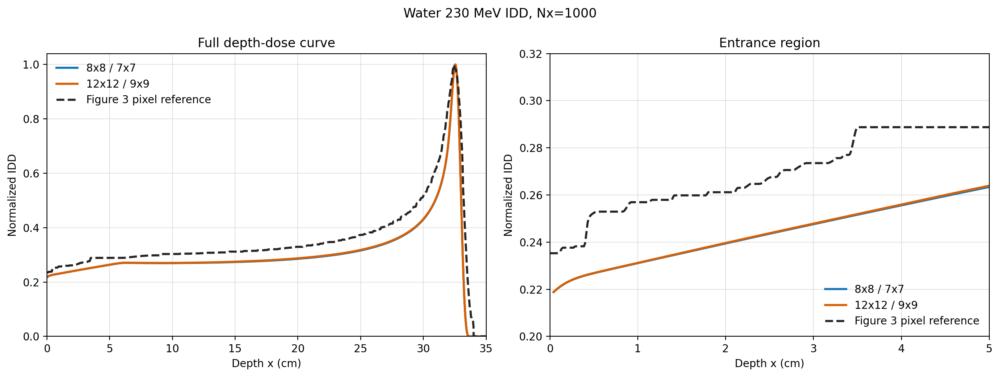

# Water 230 MeV final entrance validation

Strict settings use `Ly=Lz=8`, `Lu=Lv=2`, `sigma_yz=0.3`, a normalized
discrete angular delta, normalized initial phase-space mass, trapezoidal
transverse quadrature, the fitted `sigma_c` values without the legacy
empirical correction, and the complete Eq. (24) dose.

| grid | norm0 | BP cm | P90 cm | D90 cm | D20 cm |
|---|---:|---:|---:|---:|---:|
| Nx1000 / 8x8 / 7x7 | 0.218797169 | 32.5600 | 32.3066 | 32.7443 | 33.2153 |
| Nx1000 / 12x12 / 9x9 | 0.218866538 | 32.5600 | 32.3051 | 32.7437 | 33.2150 |

The normalized entrance difference is `6.9369e-5`. The normalized-curve L2
difference is `0.0041161`, and the Linf difference is `0.0020213`. The
pixel-derived Figure 3 green reference entrance is `0.235294`; the former
script value `0.25` was a fixed visual anchor rather than a digitized sample.

At the 230 MeV beam group, the water fitted catastrophic cross section is
`0.00325418`. The legacy empirical correction changes it to `-0.00127124`,
which is then clipped to zero by the transport and dose kernels.
